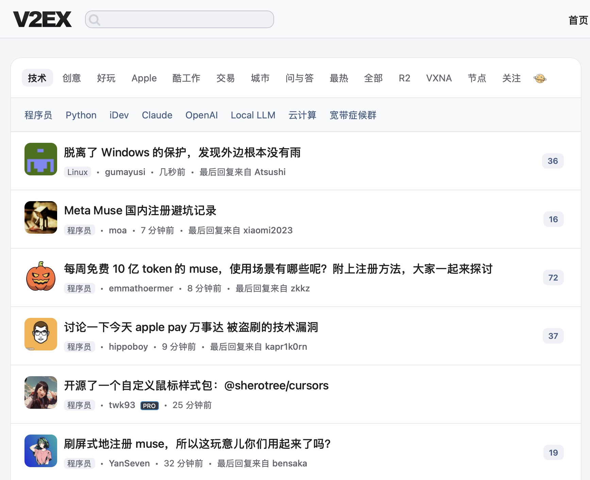
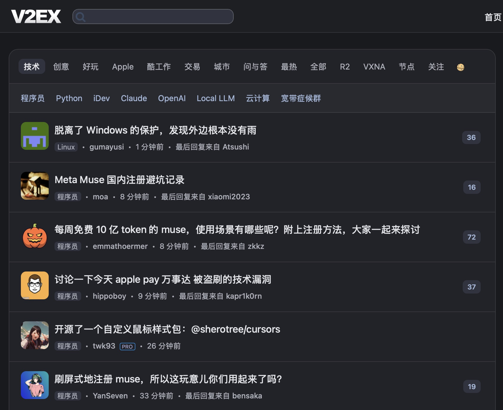
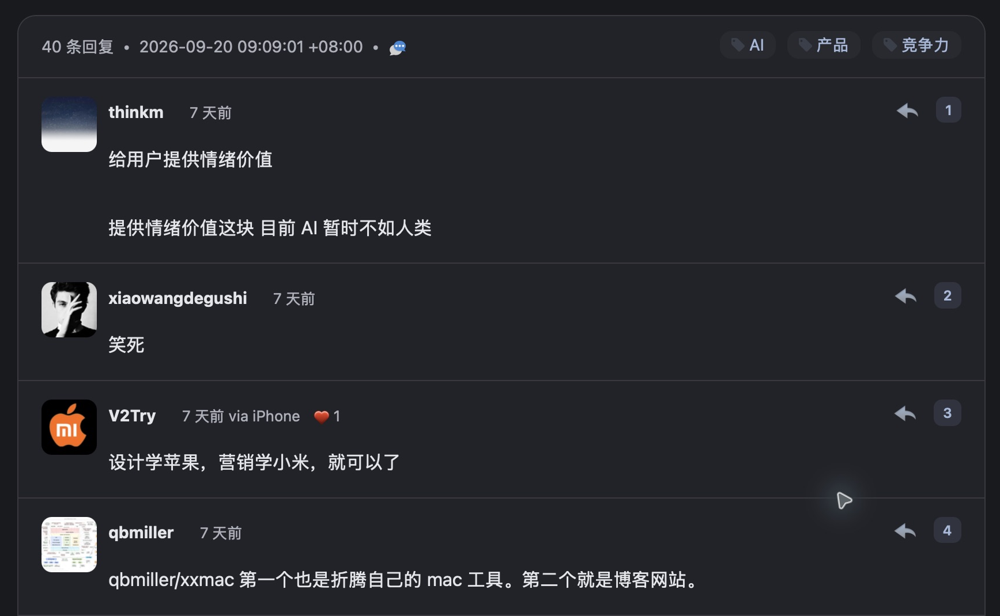

# V2EX Still

一套偏向 macOS / Safari 阅读感受的 V2EX 桌面网页主题。克制的灰白与蓝灰配色、清晰的文字层级，以及适合读帖的间距。

这是从个人自用样式整理出的首个公开版本。纯 CSS，不需要浏览器扩展，也不包含 JavaScript、外部字体或图片资源。非 V2EX 官方项目，与 Apple 无关联。

## 效果预览

以下为 macOS Safari 的真实页面截图，已裁去账户侧栏和浏览器标签。

### 浅色首页



### 深色首页



### 深色回复区



## 安装

1. 登录 V2EX，打开[设置](https://www.v2ex.com/settings)。
2. 先备份现有的「自定义 CSS」，开启「使用自定义 CSS」。
3. 清空原有内容，粘贴下面这一行，保存后刷新页面：

```css
@import url("https://cdn.jsdelivr.net/gh/StillNotYet/v2ex-still@v1.0.1/v2ex-still.min.css");
```

建议使用上面的固定版本，不会随主分支更新而自动改变。升级时自行更换版本号。`@import` 必须放在自定义 CSS 最前面；不建议与其他整套主题叠加。

CDN 加载不畅时，可以打开仓库内的 [v2ex-still.min.css](v2ex-still.min.css)，复制完整内容直接粘贴到 V2EX 自定义 CSS 中。本版本文件小于 8 KB；不要直接粘贴排版后的源码文件，可能超过 V2EX 的长度限制。

关闭「使用自定义 CSS」即可停用；恢复备份内容即可回到之前的主题。

## v1.0.1 更新

- 恢复首页和节点列表的已读标题颜色区分。
- 夜间正文、回复图片亮度降至 82%，悬停恢复；图片链接获得键盘焦点时也会恢复。不影响头像和浅色模式。
- 图片降亮对所有正文图片生效，纯 CSS 不识别图片是否白底。

## 调整了什么

- 使用系统字体，调整标题、正文与元信息的字号和对比度。
- 统一容器、分隔线、搜索框、按钮、输入框与下拉菜单的视觉。
- 收紧顶部导航与内容区的距离，统一正文与附言的对齐。
- 适配 V2EX 自带的深色模式，包括节点标题、回复用户名、楼层和表单。
- 将页码按钮点击区域扩大到至少 32 × 32 CSS 像素。

深浅色跟随 V2EX 站内开关，不是自动跟随 macOS 系统主题。

## 适用范围

主要面向桌面端，开发与人工验收环境为 macOS Safari。已检查首页、节点页、帖子正文与回复、附言、分页、设置页，以及对应的深浅色显示。没有完成全站、移动端和跨浏览器兼容测试。

CSS 使用 `:has()`、CSS 变量和 `backdrop-filter` 等现代浏览器特性。移动端并非本版本的适配目标；窄桌面窗口会隐藏右侧栏。V2EX 的页面结构或其他扩展可能影响显示。

欢迎通过 [Issues](https://github.com/StillNotYet/v2ex-still/issues) 反馈问题，附上页面类型、浏览器版本、深浅模式和截图即可。请先遮住截图中的账户信息。

## 文件与版本

- `v2ex-still.css`：便于阅读的源码。
- `v2ex-still.min.css`：安装与 CDN 分发文件，与首发时自用的样式一致。
- [CHANGELOG.md](CHANGELOG.md)：版本记录。

首个公开版本为 `v1.0.0`。固定版本发布后不覆写，后续修正使用新的版本号。

## License

[MIT](LICENSE) © StillNotYet

## 构建

修改 `v2ex-still.css` 后运行 `python3 build.py`，生成压缩文件并检查 V2EX 的 8K 长度限制。压缩版会缩短内部 CSS 变量名。
